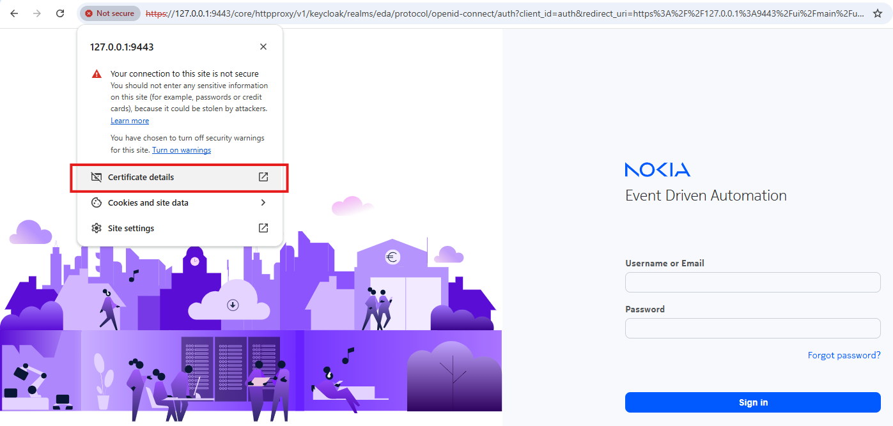
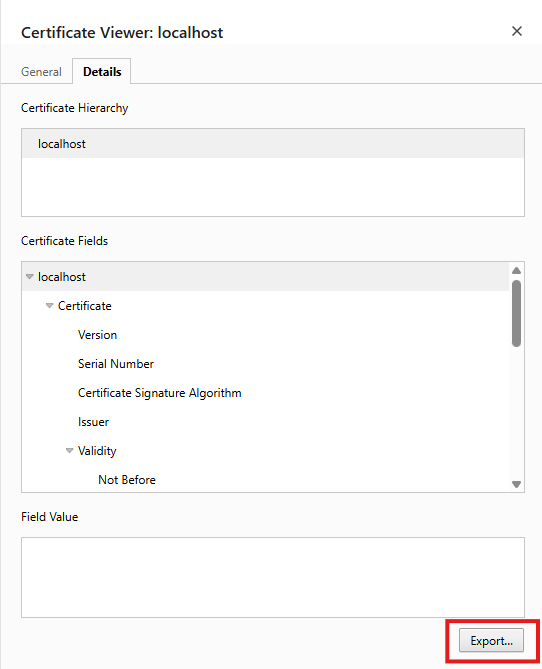
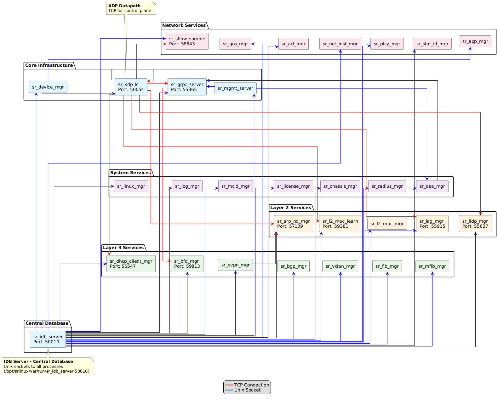
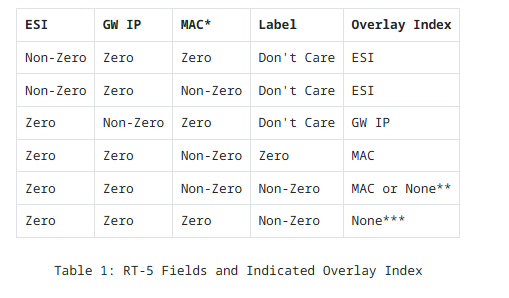

# Testing EDA on WSL

## Installation (Windows Laptop)

Source mostly derived https://docs.eda.dev/25.4/software-install/non-production/wsl/ and related links + chatgpt :-)
Long story short: this is a no-brainer and works out of the box. Nokia made it very easy to try with the makefile . 

### Zscaler skip

Deactivate Zscaler security for the EDA installation (too many issues with certs otherwise).


### Installation Steps

Prerequisites: make sure wsl version is greater than 2.5
```
PS C:\Users\xxxxxxxx> wsl --version
WSL version: 2.6.1.0
Kernel version: 6.6.87.2-1
WSLg version: 1.0.66
MSRDC version: 1.2.6353
Direct3D version: 1.611.1-81528511
DXCore version: 10.0.26100.1-240331-1435.ge-release
Windows version: 10.0.26100.6899
```

Installation
- Get the base containerlab image by downloading the .wsl file (I used the one from here https://github.com/srl-labs/wsl-containerlab/releases/tag/0.71.1-1.0 )
- Double-click on the .wsl file to install the distribution in wsl
- Connect to the image (wsl -d Containerlab) and type the following:
```
sudo apt-get update
sudo update-ca-certificates
git clone https://github.com/nokia-eda/playground
cd playground
export EXT_DOMAIN_NAME=localhost
make try-eda
```

After some time
```
[...]
--> INFO: The UI can be reached using:
          https://127.0.0.1:9443
          https://::1:9443
          https://172.18.0.1:9443
          https://172.17.0.1:9443
          https://172.19.124.218:9443
          https://10.255.255.254:9443
          https://fc00:f853:ccd:e793::1:9443
          https://C-5CG53743Q8.localdomain:9443
--> INFO: EDA is launched
```
And that's all, this is installed. 

### Customization

The line below permits to 
- access kubectl in the WSL instance (PATH)
- edactl a handy wrapper to interact with the system
- e9s 

```
cd
echo 'export PATH=$PATH:/home/clab/playground/tools/' >> ~/.bashrc
echo "source <(kubectl completion bash)" >>.bashrc
echo "alias edactl='kubectl -n eda-system exec -it \$(kubectl -n eda-system get pods -l eda.nokia.com/app=eda-toolbox -o jsonpath=\"{.items[0].metadata.name}\") -- edactl'" >> ~/.bashrc
echo "alias e9s='kubectl -n eda-system exec -it \$(kubectl -n eda-system get pods -l eda.nokia.com/app=eda-toolbox -o jsonpath=\"{.items[0].metadata.name}\") -- sh -c \"TERM=xterm-256color e9s\"'" >> ~/.bashrc
source .bashrc
```

### Install Adds-on

Interestingly with this install, k9s is natively there too.

``
clab@C-5CG53743Q8:~/playground$ k9s
`` 


## Overview

This is a kube-native app ! Let's see what we have inside.

```
clab@C-5CG53743Q8:~/playground$ docker ps --all
CONTAINER ID   IMAGE                  COMMAND                  CREATED          STATUS          PORTS                                                NAMES
1fcf2e760ac2   kindest/node:v1.33.1   "/usr/local/bin/entr…"   16 minutes ago   Up 16 minutes   127.0.0.1:39723->6443/tcp, 0.0.0.0:9443->32767/tcp   eda-demo-control-plane
clab@C-5CG53743Q8:~/playground$ docker exec -it 1fcf2e760ac2 bash
root@eda-demo-control-plane:/# kubectl get ns
NAME                 STATUS   AGE
cert-manager         Active   14m
default              Active   16m
eda                  Active   12m
eda-system           Active   15m
kube-node-lease      Active   16m
kube-public          Active   16m
kube-system          Active   16m
local-path-storage   Active   16m
metallb-system       Active   16m
root@eda-demo-control-plane:
root@eda-demo-control-plane:/# kubectl  get pods -A
NAMESPACE            NAME                                             READY   STATUS    RESTARTS   AGE
cert-manager         cert-manager-777c6f8ff4-rgmzs                    1/1     Running   0          17m
cert-manager         cert-manager-cainjector-6558fc6578-p7v2s         1/1     Running   0          17m
cert-manager         cert-manager-webhook-6964489477-d79q9            1/1     Running   0          17m
eda-system           cert-manager-csi-driver-bnvxk                    3/3     Running   0          16m
eda-system           cx-eda--leaf1-sim-7675894f69-vcq9x               2/2     Running   0          8m14s
eda-system           cx-eda--leaf2-sim-778f64c867-tzmbc               2/2     Running   0          8m9s
eda-system           cx-eda--spine1-sim-6b7f5f6db8-7xqr6              2/2     Running   0          8m9s
eda-system           cx-eda--testman-default-sim-78dc8b8495-nz7fh     2/2     Running   0          8m16s
eda-system           eda-api-fc65bd66c-dw74c                          1/1     Running   0          15m
eda-system           eda-appstore-96bccd846-wlmkf                     1/1     Running   0          15m
eda-system           eda-asvr-75c9d8d978-5xk7x                        1/1     Running   0          15m
eda-system           eda-bsvr-6d79d7d5cc-8jhnm                        1/1     Running   0          15m
eda-system           eda-ce-598f7bfb7d-wzjtc                          1/1     Running   0          15m
eda-system           eda-cert-checker-6b9b6f466b-6m7b5                1/1     Running   0          15m
eda-system           eda-cx-6bd94c6b46-7vzk6                          1/1     Running   0          15m
eda-system           eda-fe-747957d476-jflxd                          1/1     Running   0          15m
eda-system           eda-fluentbit-5fn65                              1/1     Running   0          17m
eda-system           eda-fluentd-9b78f4c9f-b6w5p                      1/1     Running   0          17m
eda-system           eda-git-7487f97b5f-lvplr                         1/1     Running   0          16m
eda-system           eda-git-replica-6799f7bccb-bbj8m                 1/1     Running   0          16m
eda-system           eda-keycloak-7597dcb964-ctprh                    1/1     Running   0          15m
eda-system           eda-metrics-server-788b466b77-hhknr              1/1     Running   0          15m
eda-system           eda-npp-0                                        1/1     Running   0          5m3s
eda-system           eda-npp-1                                        1/1     Running   0          4m33s
eda-system           eda-postgres-bb4c86cc9-d76b6                     1/1     Running   0          15m
eda-system           eda-sa-5f8c677f97-n6gcm                          1/1     Running   0          15m
eda-system           eda-sc-6778dbb78f-8mqx2                          1/1     Running   0          15m
eda-system           eda-se-559f8894d6-44qm5                          1/1     Running   0          15m
eda-system           eda-toolbox-76886bc564-npz76                     1/1     Running   0          15m
eda-system           trust-manager-849b644bdf-9ghst                   1/1     Running   0          16m
kube-system          coredns-674b8bbfcf-5t4st                         1/1     Running   0          18m
kube-system          coredns-674b8bbfcf-9sp2z                         1/1     Running   0          18m
kube-system          etcd-eda-demo-control-plane                      1/1     Running   0          18m
kube-system          kindnet-kjd7w                                    1/1     Running   0          18m
kube-system          kube-apiserver-eda-demo-control-plane            1/1     Running   0          18m
kube-system          kube-controller-manager-eda-demo-control-plane   1/1     Running   0          18m
kube-system          kube-proxy-c7fbh                                 1/1     Running   0          18m
kube-system          kube-scheduler-eda-demo-control-plane            1/1     Running   0          18m
local-path-storage   local-path-provisioner-7dc846544d-2r56c          1/1     Running   0          18m
metallb-system       controller-5cbffbc46b-vrk6n                      1/1     Running   0          18m
metallb-system       speaker-6prgv                                    1/1     Running   0          18m
root@eda-demo-control-plane:/#
```
So in summary:

We have classical kubernetes overlays (various ns):
 - **cert-manager**: certificate management
 - **metallb**: local Load balancer
 - **local-path-storage**: local storage (pv)

More interesting things in the eda-system namespace:
- **Simulators**
  - `cx-eda--leaf1-sim`, `cx-eda--leaf2-sim`, `cx-eda--spine1-sim`, `cx-eda--testman-default-sim`
  - *Role:* EDA provides a built-in CX engine (Digital Twin) for network simulation. Here we simulate leaf/spine nodes and test manager for fabric topology.
- **Core Services**
  - `eda-api`, `eda-appstore`, `eda-asvr`, `eda-bsvr`, `eda-ce`, `eda-fe`, `eda-sa`, `eda-sc`, `eda-se`
  - *Role:* PI, app store, and core EDA services for orchestration and automation.
- **Support Services**
  - `eda-postgres`, `eda-keycloak`, `eda-metrics-server`, `eda-toolbox`
  - *Role:* Database, authentication, metrics, and utility tools.
- **Logging**
  - `eda-fluentbit`, `eda-fluentd`
  - *Role:* Collect and forward logs for observability.
- **Git Integration**
  - `eda-git`, `eda-git-replica`
  - *Role:* Manage GitOps workflows and configuration repositories.
- **Cert & Trust**
  - `eda-cert-checker`, `trust-manager`
  - *Role:* Certificate validation and trust management.
- **NPP Nodes**
  - `eda-npp-0`, `eda-npp-1`
  - *Role:* **Node Provisioning Platform** agents for Zero-Touch Provisioning (ZTP). Push initial configs /bootstrap scripts to network devices, ConfigEngine, IP assignment, TLS profiles...

There are tons of CRs - full list [here.](assets/crds.log)

```
root@eda-demo-control-plane:/# kubectl get crds
NAME                                                    CREATED AT
addresspools.metallb.io                                 2025-11-24T13:37:47Z
aggregateroutes.protocols.eda.nokia.com                 2025-11-24T13:47:34Z
alarms.core.eda.nokia.com                               2025-11-24T13:40:12Z
root@eda-demo-control-plane:/# kubectl get crds | grep nokia | wc
    168     336   12936
root@eda-demo-control-plane:/#


```
### Testing / Fabric config

The following topology is pre-loaded with make try-eda.


```
clab@C-5CG53743Q8:~/playground$ make topology-load
--> TOPO: JSON Processing
configmap/eda-topology configured
configmap/eda-topology-sim unchanged
--> TOPO: config created in cluster
--> TOPO: Using POD_NAME: eda-api-fc65bd66c-dw74c
--> TOPO: Checking if eda-api-fc65bd66c-dw74c is Running
[...]
root@eda-demo-control-plane:/# kubectl get -n eda cm eda-topology -o yaml
apiVersion: v1
data:
  eda.yaml: |
    ---
    items:
      - spec:
          nodes:
            - name: leaf1
              labels:
                eda.nokia.com/role: leaf
                eda.nokia.com/security-profile: managed
              spec:
                operatingSystem: srl
                version: 25.7.2
                platform: 7220 IXR-D3L
                nodeProfile: srlinux-ghcr-25.7.2
[...]
          links:
            - name: leaf1-spine1-1
              labels:
                eda.nokia.com/role: interSwitch
              spec:
                links:
                  - local:
                      node: leaf1
                      interface: ethernet-1-1
                    remote:
                      node: spine1
                      interface: ethernet-1-1
                    type: interSwitch
[...]

```

Check the nodes. Note that NPP is disconnected. This is not good. I tried many things, but couldn't spot the issue (looks like npp can't reach CX switches ? might be TLS-related  ?) .

```
root@eda-demo-control-plane:/# kubectl get -n eda toponodes
NAME     PLATFORM       VERSION   OS    ONBOARDED   MODE     NPP            NODE   AGE
leaf1    7220 IXR-D3L   25.7.2    srl   true        normal   Disconnected          141m
leaf2    7220 IXR-D3L   25.7.2    srl   true        normal   Disconnected          141m
spine1   7220 IXR-D5    25.7.2    srl   true        normal   Disconnected          141m
root@eda-demo-control-plane:/#
root@eda-demo-control-plane:/# kubectl get -n eda topolinks
NAME                 AGE
leaf1-2-e1212        145m
leaf1-e1011          145m
leaf1-ethernet-1-3   145m
leaf1-ethernet-1-4   145m
leaf1-ethernet-1-5   145m
leaf1-ethernet-1-6   145m
leaf1-ethernet-1-7   145m
leaf1-ethernet-1-8   145m
leaf1-ethernet-1-9   145m
leaf1-spine1-1       145m
leaf1-spine1-2       145m
leaf2-e1011          145m
leaf2-ethernet-1-3   145m
leaf2-ethernet-1-4   145m
leaf2-ethernet-1-5   145m
leaf2-ethernet-1-6   145m
leaf2-ethernet-1-7   145m
leaf2-ethernet-1-8   145m
leaf2-ethernet-1-9   145m
leaf2-spine1-1       145m
leaf2-spine1-2       145m
root@eda-demo-control-plane:/# k
```

OK something went wrong ( probably messed up with reactivating zscaler security too early ?). Let's restart the install:

```
make teardown-cluster
rm -rf eda-kpt
export EXT_DOMAIN_NAME=localhost
make try-eda
```

Now it works !

```
root@eda-demo-control-plane:/# kubectl get toponodes -A
NAMESPACE   NAME     PLATFORM       VERSION   OS    ONBOARDED   MODE     NPP         NODE     AGE
eda         leaf1    7220 IXR-D3L   25.7.2    srl   true        normal   Connected   Synced   4m34s
eda         leaf2    7220 IXR-D3L   25.7.2    srl   true        normal   Connected   Synced   4m34s
eda         spine1   7220 IXR-D5    25.7.2    srl   true        normal   Connected   Synced   4m34s
root@eda-demo-control-plane:/# 
```

You can connect to cli of the emulated devices from k8s (admin/NokiaSrl1!).

```
root@eda-demo-control-plane:/# kubectl get pods -A| grep sim
eda-system           cx-eda--leaf1-sim-65bcb67766-fwjcm               2/2     Running   0          75m
eda-system           cx-eda--leaf2-sim-74645ff576-q76cv               2/2     Running   0          75m
eda-system           cx-eda--spine1-sim-ccd9976f-t75kr                2/2     Running   0          75m
eda-system           cx-eda--testman-default-sim-78dc8b8495-csj5l     2/2     Running   0          75m
root@eda-demo-control-plane:/#

root@eda-demo-control-plane:/# kubectl exec -it cx-eda--leaf1-sim-65bcb67766-fwjcm -n eda-system -- ssh admin@localhost
Defaulted container "leaf1" out of: leaf1, cxdp
admin@localhost's password:
Last login: Tue Nov 25 12:02:10 2025 from ::1


Loading environment configuration file(s): ['/etc/opt/srlinux/srlinux.rc']
Welcome to the Nokia SR Linux CLI.

--{ + running }--[  ]--
A:admin@leaf1#
```

Inspection of gnmi (grpc Network Management Interface) from npp on port 57400. npp agent pods are connected to all routers. Sessions is load shared between npp-0 and npp-1.

```
root@eda-demo-control-plane:/# kubectl get pods -o wide -A | grep cx
eda-system           cx-eda--leaf1-sim-65bcb67766-fwjcm               2/2     Running   0          161m   10.244.0.36   eda-demo-control-plane   <none>           <none>
eda-system           cx-eda--leaf2-sim-74645ff576-q76cv               2/2     Running   0          161m   10.244.0.35   eda-demo-control-plane   <none>           <none>
eda-system           cx-eda--spine1-sim-ccd9976f-t75kr                2/2     Running   0          161m   10.244.0.34   eda-demo-control-plane   <none>           <none>
root@eda-demo-control-plane:/# kubectl exec -it -n eda-system eda-npp-0 -- ss -laptnu | grep 57400
tcp   ESTAB  0      0      [::ffff:10.244.0.37]:33284  [::ffff:10.244.0.35]:57400 users:(("sr_npp",pid=70,fd=35))
tcp   ESTAB  0      0      [::ffff:10.244.0.37]:56220  [::ffff:10.244.0.36]:57400 users:(("sr_npp",pid=70,fd=49))
root@eda-demo-control-plane:/#
root@eda-demo-control-plane:/# kubectl exec -it -n eda-system eda-npp-1 -- ss -laptnu | grep 57400
tcp   ESTAB  0      0      [::ffff:10.244.0.38]:39802  [::ffff:10.244.0.34]:57400 users:(("sr_npp",pid=70,fd=35))

#### Question: can't establish sessions via gnmic ?

root@eda-npp-1:/opt/srlinux/bin$ gnmic -a 10.244.0.36:57400   --tls-ca /var/run/eda/tls/internal/trust/trust-bundle.pem   --tls-cert /var/run/eda/tls/internal/client/tls.crt   --tls-key /var/run/eda/tls/internal/client/tls.key   capabilities
^C
received signal 'interrupt'. terminating...
root@eda-npp-1:/opt/srlinux/bin$

```

Let's try fabric configuration from this [example](https://docs.eda.dev/25.4/getting-started/units-of-automation/#__tabbed_1_1)

```
clab@C-5CG53743Q8:~/playground$ kubectl get -n eda Fabric -o yaml
apiVersion: v1
items:
- apiVersion: fabrics.eda.nokia.com/v1alpha1
  kind: Fabric
  metadata:
    annotations:
      kubectl.kubernetes.io/last-applied-configuration: |
        {"apiVersion":"fabrics.eda.nokia.com/v1alpha1","kind":"Fabric","metadata":{"annotations":{},"name":"myfabric-1","namespace":"eda"},"spec":{"interSwitchLinks":{"linkSelector":["eda.nokia.com/role=interSwitch"],"unnumbered":"IPV6"},"leafs":{"leafNodeSelector":["eda.nokia.com/role=leaf"]},"overlayProtocol":{"protocol":"EBGP"},"spines":{"spineNodeSelector":["eda.nokia.com/role=spine"]},"systemPoolIPV4":"systemipv4-pool","underlayProtocol":{"bgp":{"asnPool":"asn-pool"},"protocol":["EBGP"]}}}
    creationTimestamp: "2025-11-25T15:31:56Z"
    generation: 1
    name: myfabric-1
    namespace: eda
    resourceVersion: "38018"
    uid: 25889dde-0b50-4d8d-bd3b-192af7b84ac5
  spec:
    interSwitchLinks:
      linkSelector:
      - eda.nokia.com/role=interSwitch
      unnumbered: IPV6
    leafs:
      leafNodeSelector:
      - eda.nokia.com/role=leaf
    overlayProtocol:
      protocol: EBGP
    spines:
      spineNodeSelector:
      - eda.nokia.com/role=spine
    systemPoolIPV4: systemipv4-pool
    underlayProtocol:
      bgp:
        asnPool: asn-pool
      protocol:
      - EBGP
  status:
    borderLeafNodes: []
    health: 100
    healthScoreReason: |
      Breakdown:
      Metric "ISL Health", weight: 1, score: 100, calculation method: divide
      Metric "DefaultRouter Health", weight: 1, score: 100, calculation method: divide
    lastChange: "2025-11-25T15:32:09.000Z"
    leafNodes:
    - node: leaf1
      operatingSystem: srl
      operatingSystemVersion: 25.7.2
      underlayAutonomousSystem: 100
    - node: leaf2
      operatingSystem: srl
      operatingSystemVersion: 25.7.2
      underlayAutonomousSystem: 102
    operationalState: up
    spineNodes:
    - node: spine1
      operatingSystem: srl
      operatingSystemVersion: 25.7.2
      underlayAutonomousSystem: 101
    superSpineNodes: []
kind: List
metadata:

```

### edactl and e9s

- edactl command is very practical to fetch things from different components (kube-api, nodes, git...)
- e9s shows a dashboard a la k9s

```
clab@C-5CG53743Q8:~$ edactl get -n eda toponodes
NAME     PLATFORM       VERSION   OS    ONBOARDED   MODE     NPP         NODE
leaf1    7220 IXR-D3L   25.7.2    srl   true        normal   Connected   Synced
leaf2    7220 IXR-D3L   25.7.2    srl   true        normal   Connected   Synced
spine1   7220 IXR-D5    25.7.2    srl   true        normal   Connected   Synced
clab@C-5CG53743Q8:~$ edactl node get-config leaf1 -n eda | head
interface ethernet-1/1 {
    admin-state enable
    subinterface 0 {
        admin-state enable
        ipv6 {
            admin-state enable
            router-advertisement {
                router-role {
                    admin-state enable
                    max-advertisement-interval 10
clab@C-5CG53743Q8:~$
[...]
```


### Eda api

Reference documentation is [here](https://docs.eda.dev/25.8/development/api/#__tabbed_1_2)

Base URL for EDA on WSL is https://127.0.0.1:9443. This is dispatched via eda-apî (there is no ingress microservice). 

To access the API via WSL:

1. Update ca certificate list 

1.1 Export the certificate from your browser while connecting to the EDA UI 





1.2 copy the certificate to WSL and update certificate list

```
sudo cp /mnt/c/Users/rirobert/certificate-eda-api.crt /usr/local/share/ca-certificates/
sudo update-ca-certificates
```

2. Access the API.

The following steps are all captured in a script located [here](src/explore-api.sh)
- keycloak auth
- get client uuid
- get secret and token
- api calls

The result is captured [here](assets/eda-api-access.log) - extract below with a few api endpoints.

```
[...]
{
  "paths": {
    "/apps/aaa.eda.nokia.com/v1alpha1": {
      "x-eda-nokia-com": {
        "serverRelativeURL": "/openapi/v3/apps/aaa.eda.nokia.com/v1alpha1",
        "title": "AAA Application APIs"
      }
    },
    "/apps/aifabrics.eda.nokia.com/v1alpha1": {
      "x-eda-nokia-com": {
        "serverRelativeURL": "/openapi/v3/apps/aifabrics.eda.nokia.com/v1alpha1",
        "title": "AIFabrics Application APIs"
      }
    },
    "/apps/appstore.eda.nokia.com/v1": {
      "x-eda-nokia-com": {
        "serverRelativeURL": "/openapi/v3/apps/appstore.eda.nokia.com/v1",
        "title": "App Store Application APIs"
      }
    },
[...]
```

### SRlinux stuffs

#### npp dig

Schema from npp
```
 curl https://eda-asvr.eda-system.svc/eda-system/schemaprofiles/srlinux-ghcr-25.7.2/srlinux-25.7.2.zip /var/run/eda/tls/internal/client/tls.crt /var/run/eda/tls/internal/client/tls.key /var/run/eda/tls/internal/trust/trust-bundle.pem 2>&1
```
gnmi connection from npp and subscription

```
gnmic -a 10.244.0.17 -u admin -p NokiaSrl1! --skip-verify   capabilities

--------------- get (failed but you get the schema... )

gnmic -a 10.244.0.17 -u admin -p NokiaSrl1! --skip-verify \
  get --path "/interface[name=ethernet-1/1]/state/counters" \
  --encoding JSON_IETF
target "10.244.0.17" get request failed: "10.244.0.17:57400" GetRequest failed: rpc error: code = InvalidArgument desc = Path not valid - unknown element 'state'. Options are [physical-channel, breakout-mode, statistics, traffic-rate, adapter, transceiver, ethernet, subinterface, sflow, lag, name, description, admin-state, mtu, loopback-mode, ifindex, oper-state, oper-down-reason, last-change, linecard, forwarding-complex, forwarding-mode, vlan-tagging, tpid]

gnmic -a 10.244.0.17 -u admin -p NokiaSrl1! --skip-verify \
  get --path "/interface[name=ethernet-1/1]" \
  --encoding JSON_IETF
[
  {
    "source": "10.244.0.17",
    "timestamp": 1764710665217113952,
    "time": "2025-12-02T21:24:25.217113952Z",
    "updates": [
      {
        "Path": "srl_nokia-interfaces:interface[name=ethernet-1/1]",
        "values": {
          "srl_nokia-interfaces:interface": {
            "admin-state": "disable",
            "ethernet": {
              "dac-link-training": false,
              "flow-control": {
                "receive": false
              },
              "forward-error-correction": {
                "operational-host-if-fec": "disabled"
              },
              "hold-time": {
                "down": 0,
                "up": 0
              },
              "hw-mac-address": "02:52:CC:FF:00:01",
              "lacp-port-priority": 32768,
              "port-speed": "100G",
              "srl_nokia-dot1x:dot1x": {
                "srl_nokia-dot1x-tunneling:tunnel": {
                  "oper-rule": "trap-to-cpu-untagged",
                  "tunnel-all": false
                }
              },
[...]

This is indeed the same schema as state DB

A:admin@leaf1# info interface ethernet-1/1
    admin-state disable
    mtu 9232
    loopback-mode none
    ifindex 16382
    oper-state down
    oper-down-reason port-admin-disabled
[...]

-------------- event-based (default stream mode) 

root@eda-npp-0:/opt/srlinux/protos/gnmi$ gnmic -a 10.244.0.17 -u admin -p NokiaSrl1! --skip-verify   subscribe --mode stream      --path "/interface[name=ethernet-1/1]/admin-state"   --encoding JSON_IETF

{
  "source": "10.244.0.17",
  "subscription-name": "default-1764710148",
  "timestamp": 1764710148996576638,
  "time": "2025-12-02T21:15:48.996576638Z",
  "updates": [
    {
      "Path": "srl_nokia-interfaces:interface[name=ethernet-1/1]",
      "values": {
        "srl_nokia-interfaces:interface": {
          "admin-state": "enable"
        }
      }
    }
  ]
}
{
  "source": "10.244.0.17",
  "subscription-name": "default-1764710148",
  "timestamp": 1764710176942242230,
  "time": "2025-12-02T21:16:16.94224223Z",
  "updates": [
    {
      "Path": "srl_nokia-interfaces:interface[name=ethernet-1/1]",
      "values": {
        "srl_nokia-interfaces:interface": {
          "admin-state": "disable"
        }
      }
    }
  ]
}

-------------- polling  

gnmic -a 10.244.0.17 -u admin -p NokiaSrl1! --skip-verify   subscribe --mode stream --stream-mode sample --sample-interval 5s   --path "/interface[name=ethernet-1/1]/statistics"   --encoding JSON_IETF

{
  "source": "10.244.0.17",
  "subscription-name": "default-1764709996",
  "timestamp": 1764709996581326032,
  "time": "2025-12-02T21:13:16.581326032Z",
  "updates": [
    {
      "Path": "srl_nokia-interfaces:interface[name=ethernet-1/1]/statistics",
      "values": {
        "srl_nokia-interfaces:interface/statistics": {
          "carrier-transitions": "3",
          "in-broadcast-packets": "0",
          "in-discarded-packets": "0",
          "in-error-packets": "0",
          "in-fcs-error-packets": "0",
          "in-multicast-packets": "1321",
          "in-octets": "175974",
          "in-packets": "1799",
          "in-unicast-packets": "478",
          "out-broadcast-packets": "0",
          "out-discarded-packets": "0",
          "out-error-packets": "0",
          "out-mirror-octets": "0",
          "out-mirror-packets": "0",
          "out-multicast-packets": "1268",
          "out-octets": "178426",
          "out-packets": "1745",
          "out-unicast-packets": "477"
        }
      }
    }
  ]
}


------- gnmi is the same as monitor in CLI - very good !! 

A:admin@leaf1# monitor from state interface ethernet-1/1 admin-state
[2025-12-03 13:05:56.369529]: update /interface[name=ethernet-1/1]/admin-state:enable
[2025-12-03 13:09:19.745637]: update /interface[name=ethernet-1/1]/admin-state:disable


```

#### Process and Connections 

Now let's investigate the sr Linux processes and connections between. 
This is summarized in the below puml diagram.

 

The results of bash commands used for this diagram (ss and ps) on leaf1 switch (simulated) is located [here.](assets/processes%20and%20connections.log)

We can see the ubiquitous role of the Impart DB.

Next, proto files and yang data models located her under /opt/srlinux/

```
[user@leaf1 srlinux]$ ls
appmgr  bin  deviations  etc  eventmgr  imm  kexec  lib  mappings  models  osync  phy  protos  python  snmp  systemd  usr  var  version  ztp
[user@leaf1 srlinux]$ cd protos/
[user@leaf1 protos]$ ls
gnmi  gnoi  gnsi  ndk  yang
[user@leaf1 protos]$ cat gnmi/gnmi
gnmi.proto      gnmi_ext.proto
[user@leaf1 protos]$ ls ../models/
authz_factory_authorization_policy.json  config.netconf_ipv6_port.json_snip  iana        srl_nokia
config.gnmi_server.json_snip             config.ptp_ipv4_ports.json_snip     ietf        ztp_config.json.j2
config.netconf_ipv4_port.json_snip       config.ptp_ipv6_ports.json_snip     openconfig  ztp_selected_interface.json.j2

```

#### ndk

First, activate ndk on leaf switches via configlet from EDA.

```
kubectl apply -f - <<EOF
apiVersion: config.eda.nokia.com/v1alpha1
kind: Configlet
metadata:
  name: enable-ndk
  namespace: eda
spec:
  endpointSelector:
    - eda.nokia.com/role=leaf
  operatingSystem: srl
  configs:
    - path: .system.ndk-server
      operation: Create
      config: |-
        {
          "admin-state": "enable"
        }
EOF
```

This works... first configlet successful !

```
clab@C-5CG53743Q8:~$ edactl node get-config -n eda leaf1 
[...]
    ndk-server {
        admin-state enable
    }

admin@leaf2:~$ sudo ss -lntp | grep 50053
LISTEN 0      4096               *:50053            *:*    users:(("sr_sdk_mgr",pid=13900,fd=27))
```

Now, on Leaf1, create virtual env and install ndk 

```
sudo mkdir ndk-try
cd ndk-try/
python3 -m venv venv
pip install srlinux-ndk
```

Explore the packages in ndk since dir(ndk) does not return much.

```
import pkgutil
import ndk
for m in pkgutil.iter_modules(ndk.__path__):
  print(m.name)

---- output
appid_service_pb2
appid_service_pb2_grpc
bfd_service_pb2
bfd_service_pb2_grpc
config_service_pb2
config_service_pb2_grpc
interface_service_pb2
interface_service_pb2_grpc
lldp_service_pb2
lldp_service_pb2_grpc
networkinstance_service_pb2
networkinstance_service_pb2_grpc
nexthop_group_service_pb2
nexthop_group_service_pb2_grpc
route_service_pb2
route_service_pb2_grpc
sdk_common_pb2
sdk_common_pb2_grpc
sdk_service_pb2
sdk_service_pb2_grpc
telemetry_service_pb2
telemetry_service_pb2_grpc
----

print(dir(sdk_service_pb2))

----output 
['AgentRegistrationRequest', 'AgentRegistrationResponse', 'AppIdRequest', 'AppIdResponse', 'DESCRIPTOR', 'KeepAliveRequest', 'KeepAliveResponse', 'Notification', 'NotificationQueryRequest', 'NotificationQueryResponse', 'NotificationQuerySubscription', 'NotificationRegisterRequest', 'NotificationRegisterResponse', 'NotificationStreamRequest', 'NotificationStreamResponse', '_AGENTREGISTRATIONREQUEST', '_AGENTREGISTRATIONRESPONSE', '_APPIDREQUEST', '_APPIDRESPONSE', '_KEEPALIVEREQUEST', '_KEEPALIVERESPONSE', '_NOTIFICATION', '_NOTIFICATIONQUERYREQUEST', '_NOTIFICATIONQUERYRESPONSE', '_NOTIFICATIONQUERYSUBSCRIPTION', '_NOTIFICATIONREGISTERREQUEST', '_NOTIFICATIONREGISTERREQUEST_OPERATION', '_NOTIFICATIONREGISTERRESPONSE', '_NOTIFICATIONSTREAMREQUEST', '_NOTIFICATIONSTREAMRESPONSE', '_SDKMGRSERVICE', '_SDKNOTIFICATIONSERVICE', '__builtins__', '__cached__', '__doc__', '__file__', '__loader__', '__name__', '__package__', '__spec__', '_builder', '_descriptor', '_descriptor_pool', '_globals', '_sym_db', '_symbol_database', 'ndk_dot_appid__service__pb2', 'ndk_dot_bfd__service__pb2', 'ndk_dot_config__service__pb2', 'ndk_dot_interface__service__pb2', 'ndk_dot_lldp__service__pb2', 'ndk_dot_networkinstance__service__pb2', 'ndk_dot_nexthop__group__service__pb2', 'ndk_dot_route__service__pb2', 'ndk_dot_sdk__common__pb2']

print(dir(sdk_service_pb2_grpc))

---- output
['SdkMgrService', 'SdkMgrServiceServicer', 'SdkMgrServiceStub', 'SdkNotificationService', 'SdkNotificationServiceServicer', 'SdkNotificationServiceStub', '__builtins__', '__cached__', '__doc__', '__file__', '__loader__', '__name__', '__package__', '__spec__', 'add_SdkMgrServiceServicer_to_server', 'add_SdkNotificationServiceServicer_to_server', 'grpc', 'ndk_dot_sdk__service__pb2']
----
```

# Srlinux Tests

## vxlan L2 configuration 

General organisation:
- network-instance (== routing-instance)
  - *type* mac-vrf
  - interfaces(list) 
    - local (ethernet)
    - vxlan 
       - *bridged* -> L2
       - *routed* -> L3 (symetric ?)
  - *protocols*
    -bgp-evpn : settings for control plane of EVPN routes (NHs, filters... )
    -bgp-vpn  : rds, vrf-export/import...
 
```
--{ + running }--[ network-instance br-foo ]--
A:admin@leaf2# info
    type mac-vrf
    interface ethernet-1/3.0 {
    }
    vxlan-interface vxlan0.0 {
    }
    protocols {
        bgp-evpn {
            bgp-instance 1 {
                admin-state enable
                vxlan-interface vxlan0.0
                evi 123
                routes {
                    bridge-table {
                        next-hop 12.0.0.2
                    }
                }
            }
        }
        bgp-vpn {
            bgp-instance 1 {
                route-target {
                    export-rt target:65000:123
                    import-rt target:65000:123
                }
            }
        }
    }
    bridge-table {
        static-mac {
            mac 00:11:11:11:22:22 {
                destination ethernet-1/3.0
            }
        }
    }

```
``` 

                   mac-vrf br-foo   [type mac-vrf] 
                                |
                                |
       (protocols bgp-evpn)               (protocols bgp-vpn)     
            [bgp-evpn]                         [bgp-vpn]
    evpn routes operations                   I/E NLRI setttings
JUNOS:                           JUNOS: 
    routing-policy
      "from protocol evpn"             vrf-target target:65000:1000"
       then next-hop...                route-distinguisher
                                       vrf-import / vrf-export
    vlan-aware vs vlan-based

                                |
                                v
               network-instance default [type default]


--{ +* candidate shared default }--[ network-instance br-foo ]--
A:admin@leaf1# tree protocols bgp-evpn
bgp-evpn
+-- bgp-instance
   +-- admin-state
   +-- encapsulation-type
   +-- vxlan-interface
   +-- evi
   +-- ecmp
   +-- internal-tags
   |  +-- set-tag-set
   +-- routes
      +-- bridge-table
      |  +-- next-hop
      |  +-- vlan-aware-bundle-eth-tag
      |  +-- mac-ip
      |  |  +-- advertise
      |  |  +-- advertise-arp-nd-only-with-mac-table-entry
      |  |  +-- advertise-arp-nd-extended-community
      |  +-- inclusive-mcast
      |     +-- advertise
      |     +-- originating-ip
      +-- route-table
         +-- mac-ip
         |  +-- advertise-gateway-mac
         +-- ip-prefix
            +-- evpn-link-bandwidth
            |  +-- advertise
            |  |  +-- weight
            |  |  +-- maximum-dynamic-weight
            |  +-- weighted-ecmp
            |     +-- admin-state
            |     +-- max-ecmp-hash-buckets-per-next-hop-group
            +-- evpn-interface-less-gateway-ip
               +-- advertise
               +-- resolve
                  +-- admin-state
                  +-- max-ecmp-hash-buckets-per-next-hop-group


--{ + candidate shared default }--[ network-instance br-foo protocols ]--
A:admin@leaf2# tree bgp-vpn
bgp-vpn
+-- combined-ecmp
+-- allow-export
+-- bgp-instance
   +-- export-policy
   +-- import-policy
   +-- route-distinguisher
   |  +-- rd
   +-- route-target
      +-- export-rt
      +-- import-rt


--{ +* candidate shared default }--[ network-instance br-foo ]--
A:admin@leaf1#

```

Summary view of the config and state

```
--{ + running }--[ network-instance br-foo ]--
A:admin@leaf1# show protocols bgp-evpn bgp-instance 1
================================================================================================================================
Net Instance   : br-foo
    bgp Instance 1 is enabled and up
--------------------------------------------------------------------------------------------------------------------------------
        VXLAN-Interface   : vxlan0.0
        evi               : 123
        ecmp              : 1
        oper-down-reason  : N/A
        EVPN Routes
            Next hop                       : None
            VLAN Aware Bundle Ethernet tag : None
            MAC/IP Routes                  : None
            IMET Routes                    : None, originating-ip None
================================================================================================================================

--{ + running }--[ network-instance br-foo ]--
A:admin@leaf1#

A:admin@leaf2# show  network-instance br-foo protocols bgp-vpn bgp-instance 1
============================================================================================================================
Net Instance   : br-foo
    bgp Instance 1
----------------------------------------------------------------------------------------------------------------------------
        route-distinguisher: 11.0.0.2:123, auto-derived-from-evi
        export-route-target: target:65000:123, manual
        import-route-target: target:65000:123, manual
============================================================================================================================

--{ + running }--[  ]--
A:admin@leaf2#

```
summary of all network instances

```
A:admin@leaf2# show network-instance summary
+------------------------+-------------+-------------+-------------+------------------------+------------------------------+
|          Name          |    Type     | Admin state | Oper state  |       Router id        |         Description          |
+========================+=============+=============+=============+========================+==============================+
| br-foo                 | mac-vrf     | enable      | up          | N/A                    |                              |
| br-foo-300             | mac-vrf     | enable      | up          | N/A                    |                              |
| default                | default     | enable      | up          | 11.0.0.2               | fabric: myfabric-1 role:     |
|                        |             |             |             |                        | leaf                         |
| l3                     | ip-vrf      | enable      | up          |                        |                              |
| mgmt                   | ip-vrf      | enable      | up          |                        | Management network instance  |
+------------------------+-------------+-------------+-------------+------------------------+------------------------------+

--{ + running }--[  ]--
A:admin@leaf2#
```

rib-in (pre / post) for evpn.

```
--{ + running }--[ network-instance default ]--

A:admin@leaf2# info from state  bgp-rib afi-safi evpn evpn rib-in-out  | more
    rib-in-pre {
        mac-ip-route 11.0.0.1:123 mac-length 48 mac-address 00:11:11:11:11:11 ip-address 0.0.0.0 ethernet-tag-id 0 neighbor fe80::88:9ff:feff:3%ethernet-1/1.0 path-id 0 {
            esi 00:00:00:00:00:00:00:00:00:00
            attr-id 17
            label1 {
                value 100
                value-type vni
            }
        }
        mac-ip-route 11.0.0.1:123 mac-length 48 mac-address 00:11:11:11:11:11 ip-address 0.0.0.0 ethernet-tag-id 0 neighbor fe80::88:9ff:feff:4%ethernet-1/2.0 path-id 0 {
            esi 00:00:00:00:00:00:00:00:00:00
            attr-id 17
            label1 {
                value 100
                value-type vni
            }
        }

    rib-in-post {
        mac-ip-route 11.0.0.1:123 mac-length 48 mac-address 00:11:11:11:11:11 ip-address 0.0.0.0 ethernet-tag-id 0 neighbor fe80::88:9ff:feff:3%ethernet-1/1.0 path-id 0 {
            esi 00:00:00:00:00:00:00:00:00:00
            attr-id 18
            last-modified "2025-12-16T08:30:33.000Z (an hour ago)"
            used-route true
            unused-weight-only false
            valid-route true
            best-route true
            backup-route false
            stale-route false
            pending-delete false
            neighbor-as 101
            group-best true
            tie-break-reason none
            label1 {
                value 100
                value-type vni
            }
        }

A:admin@leaf2# info from state bgp-rib afi-safi evpn evpn local-rib
    mac-ip-route 11.0.0.1:123 mac-length 48 mac-address 00:11:11:11:11:11 ip-address 0.0.0.0 ethernet-tag-id 0 neighbor fe80::88:9ff:feff:3%ethernet-1/1.0 path-id 0 {
        esi 00:00:00:00:00:00:00:00:00:00
        attr-id 18
        last-modified "2025-12-16T08:36:47.900Z (an hour ago)"
        used-route true
        unused-weight-only false
        valid-route true
        best-route true
        backup-route false
        stale-route false
        pending-delete false
        neighbor-as 101
        group-best true
        tie-break-reason none
        imported-network-instances [
            br-foo
        ]
        label1 {
            value 100
            value-type vni
        }
    }


A:admin@leaf1# info from state  network-instance default bgp-rib afi-safi evpn evpn local-rib  | grep -A 20  "22:22"
    mac-ip-route 11.0.0.2:123 mac-length 48 mac-address 00:11:11:11:22:22 ip-address 0.0.0.0 ethernet-tag-id 0 neighbor fe80::88:9ff:feff:1%ethernet-1/1.0 path-id 0 {
        esi 00:00:00:00:00:00:00:00:00:00
        attr-id 32
        last-modified "2025-12-16T11:48:09.100Z (2 hours ago)"
        used-route false
        unused-weight-only false
        valid-route true
        best-route true
        backup-route false
        stale-route false
        pending-delete false
        neighbor-as 101
        group-best true
        tie-break-reason none
        label1 {
            value 100
            value-type vni
        }
    }


```

```
A:admin@leaf2# show protocols bgp neighbor fe80::88:9ff:feff:3%ethernet-1/1.0 advertised-routes evpn
--------------------------------------------------------------------------------------------------------------------------------
Peer        : fe80::88:9ff:feff:3%ethernet-1/1.0, remote AS: 101, local AS: 102
Type        : static
Description : None
Group       : bgpgroup-ebgp-myfabric-1
--------------------------------------------------------------------------------------------------------------------------------
Origin codes: i=IGP, e=EGP, ?=incomplete
--------------------------------------------------------------------------------------------------------------------------------
Type 2 MAC-IP Advertisement Routes
+-----------------+------------+-------------------+-----------------+--------+-----------------+-----------------+---------+
|     Route-      |   Tag-ID   |    MAC-address    |   IP-address    |  Path  |    Next-Hop     |       MED       | LocPref |
|  distinguisher  |            |                   |                 |        |                 |                 |         |
+=================+============+===================+=================+========+=================+=================+=========+
| 11.0.0.2:123    | 0          | 00:11:11:11:22:22 | 0.0.0.0         | 0      | 11.0.0.2        | -               |         |
+-----------------+------------+-------------------+-----------------+--------+-----------------+-----------------+---------+
--------------------------------------------------------------------------------------------------------------------------------
Type 3 Inclusive Multicast Ethernet Tag Routes
+-----------------------+------------+---------------------+--------+-----------------------+-----------------------+---------+
|  Route-distinguisher  |   Tag-ID   |    Originator-IP    |  Path  |       Next-Hop        |          MED          | LocPref |
+=======================+============+=====================+========+=======================+=======================+=========+
| 11.0.0.2:123          | 0          | 11.0.0.2            | 0      | 11.0.0.2              | -                     |         |
+-----------------------+------------+---------------------+--------+-----------------------+-----------------------+---------+
-

[Override Next Hop]
--{ + candidate shared default }--[ network-instance br-foo protocols bgp-evpn bgp-instance 1 routes ]--
A:admin@leaf2# diff checkpoint 0
+     bridge-table {
+         next-hop 12.0.0.2
+     }

[...]

A:admin@leaf2# /show network-instance default protocols bgp neighbor fe80::88:9ff:feff:3%ethernet-1/1.0 advertised-routes evpn
--------------------------------------------------------------------------------------------------------------------------------
Peer        : fe80::88:9ff:feff:3%ethernet-1/1.0, remote AS: 101, local AS: 102
Type        : static
Description : None
Group       : bgpgroup-ebgp-myfabric-1
--------------------------------------------------------------------------------------------------------------------------------
Origin codes: i=IGP, e=EGP, ?=incomplete
--------------------------------------------------------------------------------------------------------------------------------
Type 2 MAC-IP Advertisement Routes
+-----------------+------------+-------------------+-----------------+--------+-----------------+-----------------+---------+
|     Route-      |   Tag-ID   |    MAC-address    |   IP-address    |  Path  |    Next-Hop     |       MED       | LocPref |
|  distinguisher  |            |                   |                 |        |                 |                 |         |
+=================+============+===================+=================+========+=================+=================+=========+
| 11.0.0.2:123    | 0          | 00:11:11:11:22:22 | 0.0.0.0         | 0      | 12.0.0.2        | -               |         |
+-----------------+------------+-------------------+-----------------+--------+-----------------+-----------------+---------+
--------------------------------------------------------------------------------------------------------------------------------
T

A:admin@leaf1# show network-instance default protocols bgp routes evpn route-type summary
*--------------------------------------------------------------------------------------------------------------------------------
Show report for the BGP route table of network-instance "default"
--------------------------------------------------------------------------------------------------------------------------------
Status codes: u=used, *=valid, >=best, x=stale, b=backup, w=unused-weight-only
Origin codes: i=IGP, e=EGP, ?=incomplete
--------------------------------------------------------------------------------------------------------------------------------
BGP Router ID: 11.0.0.1      AS: 100      Local AS: 100
--------------------------------------------------------------------------------------------------------------------------------
Type 2 MAC-IP Advertisement Routes
+----------+----------+----------+----------+----------+----------+----------+----------+----------+----------+----------+
|  Status  | Route-di |  Tag-ID  |   MAC-   |   IP-    | neighbor | Path-id  | Next-Hop |  Label   |   ESI    |   MAC    |
|          | stinguis |          | address  | address  |          |          |          |          |          | Mobility |
|          |   her    |          |          |          |          |          |          |          |          |          |
+==========+==========+==========+==========+==========+==========+==========+==========+==========+==========+==========+
| -        | 11.0.0.1 | 0        | 00:11:11 | 0.0.0.0  | fe80::88 | 0        | 11.0.0.1 | 100      | 00:00:00 | Seq:0/St |
|          | :123     |          | :11:11:1 |          | :9ff:fef |          |          |          | :00:00:0 | atic     |
|          |          |          | 1        |          | f:2%ethe |          |          |          | 0:00:00: |          |
|          |          |          |          |          | rnet-    |          |          |          | 00:00    |          |
|          |          |          |          |          | 1/2.0    |          |          |          |          |          |
| u*>      | 11.0.0.2 | 0        | 00:11:11 | 0.0.0.0  | fe80::88 | 0        | 11.0.0.2 | 100      | 00:00:00 | Seq:0/St |
|          | :123     |          | :11:22:2 |          | :9ff:fef |          |          |          | :00:00:0 | atic     |
|          |          |          | 2        |          | f:1%ethe |          |          |          | 0:00:00: |          |
|          |          |          |          |          | rnet-    |          |          |          | 00:00    |          |
|          |          |          |          |          | 1/1.0    |          |          |          |          |          |
| *        | 11.0.0.2 | 0        | 00:11:11 | 0.0.0.0  | fe80::88 | 0        | 11.0.0.2 | 100      | 00:00:00 | Seq:0/St |
|          | :123     |          | :11:22:2 |          | :9ff:fef |          |          |          | :00:00:0 | atic     |
|          |          |          | 2        |          | f:2%ethe |          |          |          | 0:00:00: |          |
|          |          |          |          |          | rnet-    |          |          |          | 00:00    |          |
|          |          |          |          |          | 1/2.0    |          |          |          |          |          |
+----------+----------+----------+----------+----------+----------+----------+----------+----------+----------+----------+
--------------------------------------------------------------------------------------------------------------------------------
Type 3 Inclusive Multicast Ethernet Tag Routes
+--------+-----------------------+------------+---------------------+-----------------------+--------+-----------------------+
| Status |  Route-distinguisher  |   Tag-ID   |    Originator-IP    |       neighbor        | Path-  |       Next-Hop        |
|        |                       |            |                     |                       |   id   |                       |
+========+=======================+============+=====================+=======================+========+=======================+
| -      | 11.0.0.1:123          | 0          | 11.0.0.1            | fe80::88:9ff:feff:2%e | 0      | 11.0.0.1              |
|        |                       |            |                     | thernet-1/2.0         |        |                       |
| u*>    | 11.0.0.2:123          | 0          | 11.0.0.2            | fe80::88:9ff:feff:1%e | 0      | 11.0.0.2              |
|        |                       |            |                     | thernet-1/1.0         |        |                       |
| *      | 11.0.0.2:123          | 0          | 11.0.0.2            | fe80::88:9ff:feff:2%e | 0      | 11.0.0.2              |
|        |                       |            |                     | thernet-1/2.0         |        |                       |
+--------+-----------------------+------------+---------------------+-----------------------+--------+-----------------------+
--------------------------------------------------------------------------------------------------------------------------------
0 Ethernet Auto-Discovery routes 0 used, 0 valid, 0 stale
3 MAC-IP Advertisement routes 1 used, 2 valid, 0 stale
3 Inclusive Multicast Ethernet Tag routes 1 used, 2 valid, 0 stale
0 Ethernet Segment routes 0 used, 0 valid, 0 stale
0 IP Prefix routes 0 used, 0 valid, 0 stale
0 Selective Multicast Ethernet Tag routes 0 used, 0 valid, 0 stale
0 Selective Multicast Membership Report Sync routes 0 used, 0 valid, 0 stale
0 Selective Multicast Leave Sync routes 0 used, 0 valid, 0 stale
--------------------------------------------------------------------------------------------------------------------------------

--{ + running }--[  ]--
A:admin@leaf1# *


A:admin@leaf1# show network-instance default protocols bgp routes evpn route-type 2 mac-address *22* detail
--------------------------------------------------------------------------------------------------------------------------------
Show report for the EVPN routes in network-instance  "default"
--------------------------------------------------------------------------------------------------------------------------------
Route Distinguisher: 11.0.0.2:123
Tag-ID             : 0
MAC address        : 00:11:11:11:22:22
IP Address         : 0.0.0.0
neighbor           : fe80::88:9ff:feff:1%ethernet-1/1.0
path-id            : 0
Received paths     : 1
  Path 1: <Best,Valid,Used,>
    ESI               : 00:00:00:00:00:00:00:00:00:00
    Label             : 100
    Route source      : neighbor fe80::88:9ff:feff:1%ethernet-1/1.0 (last modified 1h30m13s ago)
    Route preference  : No MED, LocalPref is 100
    Atomic Aggr       : false
    BGP next-hop      : 11.0.0.2
    AS Path           :  i [101, 102]
    Communities       : [target:65000:123, bgp-tunnel-encap:VXLAN, mac-mobility:Seq:0/Static]
    RR Attributes     : No Originator-ID, Cluster-List is []
    Aggregation       : None
    Unknown Attr      : None
    Invalid Reason    : None
    Tie Break Reason  : none
    Route Flap Damping: None
  Path 1 was advertised to (Modified Attributes):
  [ fe80::88:9ff:feff:2%ethernet-1/2.0 ]
    Route preference  : No MED, No LocalPref
    Atomic Aggr       : false
    BGP next-hop      : 11.0.0.2
    AS Path           :  i [100, 101, 102]
    Communities       : [target:65000:123, bgp-tunnel-encap:VXLAN, mac-mobility:Seq:0/Static]
    RR Attributes     : No Originator-ID, Cluster-List is []
    Aggregation       : None
    Unknown Attr      : None
--------------------------------------------------------------------------------------------------------------------------------
Route Distinguisher: 11.0.0.2:123
Tag-ID             : 0
MAC address        : 00:11:11:11:22:22
IP Address         : 0.0.0.0
neighbor           : fe80::88:9ff:feff:2%ethernet-1/2.0
path-id            : 0
Received paths     : 1
  Path 1: <Valid,>
    ESI               : 00:00:00:00:00:00:00:00:00:00
    Label             : 100
    Route source      : neighbor fe80::88:9ff:feff:2%ethernet-1/2.0 (last modified 1h30m14s ago)
    Route preference  : No MED, LocalPref is 100
    Atomic Aggr       : false
    BGP next-hop      : 11.0.0.2
    AS Path           :  i [101, 102]
    Communities       : [target:65000:123, bgp-tunnel-encap:VXLAN, mac-mobility:Seq:0/Static]
    RR Attributes     : No Originator-ID, Cluster-List is []
    Aggregation       : None
    Unknown Attr      : None
    Invalid Reason    : None
    Tie Break Reason  : peer-ip
    Route Flap Damping: None
--------------------------------------------------------------------------------------------------------------------------------

--{ + running }--[  ]--
A:admin@leaf1#

```


```

```

All routes are kept in BGP

```
A:admin@leaf2# /show network-instance default protocols bgp routes evpn route-type 2 ip-address 100.0.0.2 detail
--------------------------------------------------------------------------------------------------------------------------------------------------------------------------------------
Show report for the EVPN routes in network-instance  "default"
--------------------------------------------------------------------------------------------------------------------------------------------------------------------------------------
Route Distinguisher: 11.0.0.2:123
Tag-ID             : 0
MAC address        : 00:11:11:11:22:22
IP Address         : 100.0.0.2
neighbor           : fe80::88:9ff:feff:4%ethernet-1/2.0
path-id            : 0
Received paths     : 1
  Path 1: <>
    ESI               : 00:00:00:00:00:00:00:00:00:00
    Label             : 100
    Route source      : neighbor fe80::88:9ff:feff:4%ethernet-1/2.0 (last modified 11m40s ago)
    Route preference  : No MED, LocalPref is 100
    Atomic Aggr       : false
    BGP next-hop      : 11.0.0.2
    AS Path           :  i [101, 102]
    Communities       : [target:65000:123, bgp-tunnel-encap:VXLAN, mac-mobility:Seq:0/Static]
    RR Attributes     : No Originator-ID, Cluster-List is []
    Aggregation       : None
    Unknown Attr      : None
    Invalid Reason    : As_Loop               <=====================  self AS  IS KEPT !!! 
    Tie Break Reason  : none
    Route Flap Damping: None
```

#### export process of local evpn routes

Let's define a mac with IP resolution

```
A:admin@leaf2# info  network-instance br-foo bridge-table
    static-mac {
        mac 00:11:11:11:22:22 {
            destination ethernet-1/3.100
        }
        mac 00:11:11:11:33:33 {
            destination ethernet-1/3.200
        }
    }
    proxy-arp {
        static-entries {
            neighbor 100.0.0.2 {
                link-layer-address 00:11:11:11:22:22
            }
        }
    }

```

``` 
A:admin@leaf2# info from  state network-instance default bgp-rib afi-safi evpn evpn local-rib | grep -A 20 22
    mac-ip-route 11.0.0.2:123 mac-length 48 mac-address 00:11:11:11:22:22 ip-address 0.0.0.0 ethernet-tag-id 0 neighbor 0.0.0.0 path-id 0 {
        esi 00:00:00:00:00:00:00:00:00:00
        attr-id 48
        last-modified "2025-12-17T07:12:07.200Z (an hour ago)"
        used-route false
        unused-weight-only false
        valid-route true
        best-route true
        backup-route false
        stale-route false
        pending-delete false
        neighbor-as 0
        group-best true
        tie-break-reason none
        label1 {
            value 100
            value-type vni
        }
    }

### From remote switch

A:admin@leaf1# show network-instance br-foo bridge-table mac-table all
--------------------------------------------------------------------------------------------------------------------------------------------------------------------------------------
Mac-table of network instance br-foo
--------------------------------------------------------------------------------------------------------------------------------------------------------------------------------------
+--------------------+---------------------------------------------------+------------+----------------+---------+--------+---------------------------------------------------+
|      Address       |                    Destination                    | Dest Index |      Type      | Active  | Aging  |                    Last Update                    |
+====================+===================================================+============+================+=========+========+===================================================+
| 00:11:11:11:11:11  | ethernet-1/3.0                                    | 6          | static         | true    | N/A    | 2025-12-11T14:57:45.000Z                          |
| 00:11:11:11:22:22  | vxlan-interface:vxlan0.0 vtep:11.0.0.2 vni:100    | 3675954    | evpn-static    | true    | N/A    | 2025-12-16T17:26:52.000Z                          |
| 00:11:11:11:33:33  | vxlan-interface:vxlan0.0 vtep:11.0.0.2 vni:100    | 3675954    | evpn-static    | true    | N/A    | 2025-12-16T17:26:52.000Z                          |
| 02:1A:D0:FF:00:00  | vxlan-interface:vxlan0.0 vtep:11.0.0.2 vni:100    | 3675954    | evpn-static    | true    | N/A    | 2025-12-16T17:26:52.000Z                          |
+--------------------+---------------------------------------------------+------------+----------------+---------+--------+---------------------------------------------------+

A:admin@leaf1# info from state network-instance default bgp-rib afi-safi evpn evpn local-rib | grep -A 20 22:22
    mac-ip-route 11.0.0.2:123 mac-length 48 mac-address 00:11:11:11:22:22 ip-address 0.0.0.0 ethernet-tag-id 0 neighbor fe80::88:9ff:feff:1%ethernet-1/1.0 path-id 0 {
        esi 00:00:00:00:00:00:00:00:00:00
        attr-id 38
        last-modified "2025-12-18T12:35:47.300Z (a day ago)"
        used-route true
        unused-weight-only false
        valid-route true
        best-route true
        backup-route false
        stale-route false
        pending-delete false
        neighbor-as 101
        group-best true
        tie-break-reason none
        imported-network-instances [
            br-foo
        ]
        label1 {
            value 100
            value-type vni
        }
T
A:admin@leaf1# info from state network-instance default bgp-rib attr-sets attr-set 38
    origin igp
    atomic-aggregate false
    next-hop 11.0.0.2
    local-pref 100
    as-path {
        segment 0 {
            type as-sequence
            member [
                101
                102
            ]
        }
    }
    communities {
        ext-community [
            target:65000:123
            bgp-tunnel-encap:VXLAN
            mac-mobility:Seq:0/Static
        ]
    }

-
Route Distinguisher: 11.0.0.2:123
Tag-ID             : 0
MAC address        : 00:11:11:11:33:33
IP Address         : 0.0.0.0
neighbor           : fe80::88:9ff:feff:1%ethernet-1/1.0
path-id            : 0
Received paths     : 1
  Path 1: <Best,Valid,Used,>
    ESI               : 00:00:00:00:00:00:00:00:00:00
    Label             : 100
    Route source      : neighbor fe80::88:9ff:feff:1%ethernet-1/1.0 (last modified 1d1h11m40s ago)
    Route preference  : No MED, LocalPref is 100
    Atomic Aggr       : false
    BGP next-hop      : 11.0.0.2
    AS Path           :  i [101, 102]
    Communities       : [target:65000:123, bgp-tunnel-encap:VXLAN, mac-mobility:Seq:0/Static]
    RR Attributes     : No Originator-ID, Cluster-List is []
    Aggregation       : None
    Unknown Attr      : None
    Invalid Reason    : None
    Tie Break Reason  : none
    Route Flap Damping: None
  Path 1 was advertised to (Modified Attributes):
  [ fe80::88:9ff:feff:2%ethernet-1/2.0 ]
    Route preference  : No MED, No LocalPref
    Atomic Aggr       : false
    BGP next-hop      : 11.0.0.2
    AS Path           :  i [100, 101, 102]
    Communities       : [target:65000:123, bgp-tunnel-encap:VXLAN, mac-mobility:Seq:0/Static]
    RR Attributes     : No Originator-ID, Cluster-List is []
    Aggregation       : None
    Unknown Attr      : None

```
The activation of proxy arp  generates a reserved mac address.

```

--{ +* candidate shared default }--[  ]--
A:admin@leaf2# show network-instance br-foo bridge-table  mac-table  all
----------------------------------------------------------------------------------------------------------------------------
Mac-table of network instance br-foo
----------------------------------------------------------------------------------------------------------------------------
+-------------------+-----------------------------+-----------+---------+--------+-------+-----------------------------+
|      Address      |         Destination         |   Dest    |  Type   | Active | Aging |         Last Update         |
|                   |                             |   Index   |         |        |       |                             |
+===================+=============================+===========+=========+========+=======+=============================+
| 00:11:11:11:11:11 | vxlan-interface:vxlan0.0    | 3991720   | evpn-   | true   | N/A   | 2026-01-06T08:36:35.000Z    |
|                   | vtep:11.0.0.1 vni:100       |           | static  |        |       |                             |
| 00:11:11:11:22:22 | ethernet-1/3.100            | 5         | static  | true   | N/A   | 2026-01-05T09:45:07.000Z    |
| 00:11:11:11:33:33 | ethernet-1/3.200            | 6         | static  | true   | N/A   | 2026-01-05T09:45:07.000Z    |
+-------------------+-----------------------------+-----------+---------+--------+-------+-----------------------------+


A:admin@leaf2# set network-instance br-foo bridge-table proxy-arp admin-state enable

A:admin@leaf2# commit stay
All changes have been committed. Starting new transaction.

A:admin@leaf2# show network-instance br-foo bridge-table  mac-table  all
----------------------------------------------------------------------------------------------------------------------------
Mac-table of network instance br-foo
----------------------------------------------------------------------------------------------------------------------------
+-------------------+-----------------------------+-----------+---------+--------+-------+-----------------------------+
|      Address      |         Destination         |   Dest    |  Type   | Active | Aging |         Last Update         |
|                   |                             |   Index   |         |        |       |                             |
+===================+=============================+===========+=========+========+=======+=============================+
| 00:11:11:11:11:11 | vxlan-interface:vxlan0.0    | 3991720   | evpn-   | true   | N/A   | 2026-01-06T08:36:35.000Z    |
|                   | vtep:11.0.0.1 vni:100       |           | static  |        |       |                             |
| 00:11:11:11:22:22 | ethernet-1/3.100            | 5         | static  | true   | N/A   | 2026-01-05T09:45:07.000Z    |
| 00:11:11:11:33:33 | ethernet-1/3.200            | 6         | static  | true   | N/A   | 2026-01-05T09:45:07.000Z    |
| 02:1A:D0:FF:00:00 | reserved                    | 0         | reserve | false  | N/A   | 2026-01-07T16:34:35.000Z    |
|                   |                             |           | d       |        |       |                             |
+-------------------+-----------------------------+-----------+---------+--------+-------+-----------------------------+

```

#### vxlan L3

proxy ARP in L2 VRF not compatible wiht irb proxy ARP.


```
--{ +* candidate shared default }--[ network-instance l3 ]--
A:admin@leaf2# commit stay
Error in /network-instance[name=br-foo]/interface[name=irb0.100]/name:
    IRB interfaces cannot be configured with proxy-arp
Error: Commit failed
```

```
:admin@leaf2# info / network-instance br-foo
[...]
    bridge-table {
[...]
        proxy-arp {
            admin-state enable
            static-entries {
                neighbor 100.0.0.2 {
                    link-layer-address 00:11:11:11:22:22
                }
            }
        }
    }
```

```
--{ + candidate shared default }--[ network-instance l3 ]--
A:admin@leaf1# info
    type ip-vrf
    admin-state enable
    ip-forwarding {
    }
    interface irb0.100 {
    }
    interface lo1.100 {
    }
    vxlan-interface vxlan0.1000 {
    }
    protocols {
        bgp-evpn {
            bgp-instance 1 {
                vxlan-interface vxlan0.1000
                evi 1000
            }
        }
        bgp-vpn {
            bgp-instance 1 {
                route-target {
                    export-rt target:65000:1000
                    import-rt target:65000:1000
                }
            }
        }
    }
```

The mac from the vxlan (used source mac is advertised via the  mac community).


```
##### Leaf 1 receives Type 5 route 

-----------------------------------------------------------------------------------------------------------------------------------------------------------------------
Route Distinguisher: 11.0.0.2:1000
Tag-ID             : 0
ip-prefix-len      : 24
ip-prefix          : 100.0.0.0/24
neighbor           : fe80::88:9ff:feff:2%ethernet-1/2.0
path-id            : 0
Gateway IP         : 0.0.0.0
Received paths     : 1
  Path 1: <Valid,>
    ESI               : 00:00:00:00:00:00:00:00:00:00
    Label             : 1000
    Route source      : neighbor fe80::88:9ff:feff:2%ethernet-1/2.0 (last modified 9m29s ago)
    Route preference  : No MED, LocalPref is 100
    Atomic Aggr       : false
    BGP next-hop      : 11.0.0.2
    AS Path           :  i [101, 102]
    Communities       : [target:65000:1000, mac-nh:02:1a:d0:ff:00:00, bgp-tunnel-encap:VXLAN]
    RR Attributes     : No Originator-ID, Cluster-List is []
    Aggregation       : None
    Unknown Attr      : None
    Invalid Reason    : None
    Tie Break Reason  : peer-ip
    Route Flap Damping: None


##### The mac-nh is the address set for vxlan interface inner ethernet header


A:admin@leaf2# info from  state /tunnel-interface vxlan0

    vxlan-interface 1000 {
        type routed
        oper-state up
        ingress {
            vni 1000
        }
        egress {
            source-ip use-system-ipv4-address
            inner-ethernet-header {
                used-source-mac 02:1A:D0:FF:00:00
            }
        }
    }
```

Advertise static arp entries (in IRB) to L3 VRF 

```
--{ +* candidate shared default }--[ interface irb0 subinterface 100 ipv4 ]--
A:admin@leaf2# info
    admin-state enable
    address 100.0.0.252/24 {
    }
    address 100.0.0.254/24 {
        anycast-gw true
    }
    arp {
        neighbor 100.0.0.112 {   <----------------------- static entry
            link-layer-address 00:00:00:01:12:02
        }
        host-route {
            populate static {   <--------------------------- does the trick 
            }
            populate dynamic { <------------------- that's for arp learnt
            }
        }
    }


:admin@leaf1# show route-table
--------------------------------------------------------------------------------------------------------------------------------------------------
IPv4 unicast route table of network instance l3
--------------------------------------------------------------------------------------------------------------------------------------------------
+---------------+------+-----------+--------------------+---------+---------+--------+-----------+----------+----------+----------+----------+
|    Prefix     |  ID  |   Route   |    Route Owner     | Active  | Origin  | Metric |   Pref    | Next-hop | Next-hop |  Backup  |  Backup  |
|               |      |   Type    |                    |         | Network |        |           |  (Type)  | Interfac | Next-hop | Next-hop |
|               |      |           |                    |         | Instanc |        |           |          |    e     |  (Type)  | Interfac |
|               |      |           |                    |         |    e    |        |           |          |          |          |    e     |
+===============+======+===========+====================+=========+=========+========+===========+==========+==========+==========+==========+
| 30.0.0.0/24   | 0    | bgp-evpn  | bgp_evpn_mgr       | True    | l3      | 0      | 170       | 11.0.0.2 |          |          |          |
|               |      |           |                    |         |         |        |           | /32 (ind |          |          |          |
|               |      |           |                    |         |         |        |           | irect/vx |          |          |          |
|               |      |           |                    |         |         |        |           | lan)     |          |          |          |

[...] here we go 

| 100.0.0.112/3 | 0    | bgp-evpn  | bgp_evpn_mgr       | True    | l3      | 0      | 170       | 11.0.0.2 |          |          |          |
| 2             |      |           |                    |         |         |        |           | /32 (ind |          |          |          |
|        


--------------------------------------------------------------------------------------------------------------------------------------------------
Route Distinguisher: 11.0.0.2:1000
Tag-ID             : 0
ip-prefix-len      : 32
ip-prefix          : 100.0.0.112/32
neighbor           : fe80::88:9ff:feff:1%ethernet-1/1.0
path-id            : 0
Gateway IP         : 0.0.0.0
Received paths     : 1
  Path 1: <Best,Valid,Used,>
    ESI               : 00:00:00:00:00:00:00:00:00:00
    Label             : 1000
    Route source      : neighbor fe80::88:9ff:feff:1%ethernet-1/1.0 (last modified 4m30s ago)
    Route preference  : No MED, LocalPref is 100
    Atomic Aggr       : false
    BGP next-hop      : 11.0.0.2
    AS Path           :  i [101, 102]
    Communities       : [target:65000:1000, mac-nh:02:1a:d0:ff:00:00, bgp-tunnel-encap:VXLAN]
    RR Attributes     : No Originator-ID, Cluster-List is []
    Aggregation       : None
    Unknown Attr      : None
    Invalid Reason    : None
    Tie Break Reason  : none
    Route Flap Damping: None
  Path 1 was advertised to (Modified Attributes):
  [ fe80::88:9ff:feff:2%ethernet-1/2.0 ]
    Route preference  : No MED, No LocalPref
    Atomic Aggr       : false
    BGP next-hop      : 11.0.0.2
    AS Path           :  i [100, 101, 102]
    Communities       : [target:65000:1000, mac-nh:02:1a:d0:ff:00:00, bgp-tunnel-encap:VXLAN]
    RR Attributes     : No Originator-ID, Cluster-List is []
    Aggregation       : None
    Unknown Attr      : None

```

By default: has ESI =0, GW=0, and mac community. This is the Interface-less IP-VRF-to-IP-VRF Model
For redundancy: use of ESI as overlay index

Second and 5th



#### multihoming L3 virtual NH


####

all esi routes are kept in RIB even the ESI is not configured (rt-import policy not matched)

A:admin@leaf1# show /network-instance default protocols bgp routes evpn route-type 4 detail

```
Route Distinguisher: 11.0.0.2:0
ESI                : 00:80:80:80:80:80:00:00:00:00
Originating Router : 11.0.0.2
neighbor           : fe80::88:9ff:feff:1%ethernet-1/1.0
path-id            : 0
Received paths     : 1
  Path 1: <Best,Valid,>
    Route source      : neighbor fe80::88:9ff:feff:1%ethernet-1/1.0 (last modified 7m39s ago)
    Route preference  : No MED, LocalPref is 100
    Atomic Aggr       : false
    BGP next-hop      : 11.0.0.3
    AS Path           :  i [101, 102]
    Communities       : [df-election::DF-Type:Auto/DP:0/DF-Preference:0/AC:1, target:80:80:80:80:80:00]
    RR Attributes     : No Originator-ID, Cluster-List is []
    Aggregation       : None
    Unknown Attr      : None
    Invalid Reason    : None
    Tie Break Reason  : none
    Route Flap Damping: None

```

#### export static ipv4 route to BGP

```
--{ + running }--[ network-instance default ]--
A:admin@leaf2# info
    next-hop-groups {
        group blackhole {
            blackhole {
            }
        }
    }
    static-routes {
        route 123.0.0.1/32 {
            next-hop-group blackhole
            tag-value 123
        }
    }

```
route-table program:
- static_route_mgr
- origin 

```

A:admin@leaf2# info from state  route-table  ipv4-unicast

    route 123.0.0.1/32 id 0 route-type static route-owner static_route_mgr origin-network-instance default {
        leakable false
        metric 1
        preference 5
        active true
        last-app-update "2025-12-17T09:07:28.791Z (an hour ago)"
        next-hop-group 3706426
        next-hop-group-network-instance default
        resilient-hash false
        dynamic-load-balancing false
        internal-tags [
            "tag-value = 0x7b"
        ]
        fib-programming {
            suppressed false
            last-successful-operation-type add
            last-successful-operation-timestamp "2025-12-17T09:07:28.822Z (an hour ago)"
            pending-operation-type none
            last-failed-operation-type none
        }
--{ + running }--[ network-instance default ]--
A:admin@leaf2# info from state  route-table  next-hop-group 3706426
    backup-next-hop-group 0
    backup-active false
    fib-programming {
        last-successful-operation-type add
        last-successful-operation-timestamp "2025-12-17T09:07:28.806Z (an hour ago)"
        pending-operation-type none
        last-failed-operation-type none
    }
    next-hop 0 {
        next-hop 1
        resolved not-applicable
        resource-allocation-failed false
    }

--{ + running }--[ network-instance default ]--

A:admin@leaf2# info from state  route-table  next-hop 1
    resource-allocation-failed false
    type discard

--{ + running }--[ network-instance default ]--
A:admin@leaf2#

```

- with no special export it appears in loc-rib - which is a bgp rib - 
- this is not in rib-out (fortunately)

```
A:admin@leaf2# info from state  bgp-rib afi-safi ipv4-unicast ipv4-unicast local-rib | grep -A 20 123
    route 123.0.0.1/32 neighbor 0.0.0.0 origin-protocol static path-id 0 {
        last-modified "2025-12-17T09:07:28.800Z (2 hours ago)"
        used-route true
        unused-weight-only false
        valid-route true
        best-route true
        backup-route false
        stale-route false
        fib-disabled false
        pending-delete false
        group-best true
        tie-break-reason none
        attr-id 52
    }

A:admin@leaf2# info from state bgp-rib afi-safi ipv4-unicast ipv4-unicast rib-in-out rib-out-post | grep 123

--{ + candidate shared default }--[ network-instance default ]--
A:admin@leaf2#

```

- add a stement for this route to export policy  

```
A:admin@leaf2# info /routing-policy policy ebgp-isl-export-policy-myfabric-1 statement 50
    match {
        protocol static
        internal-tags {
            tag-set [
                tagset123
            ]
        }
    }
    action {
        policy-result accept
        bgp {
            standard-community {
                operation add
                method reference
                referenced-sets [
                    comm123
                ]
            }
            local-preference {
                set 123
            }
        }
    }
```

```

### route-table ###

A:admin@leaf2# info from state /network-instance default route-table ipv4-unicast

    route 123.0.0.1/32 id 0 route-type static route-owner static_route_mgr origin-network-instance default {
        leakable false
        metric 1
        preference 5
        active true
        last-app-update "2025-12-17T11:39:42.459Z (an hour ago)"
        next-hop-group 3706426
        next-hop-group-network-instance default
        resilient-hash false
        dynamic-load-balancing false
        internal-tags [
            "tag-value = 0x7b"
        ]
        fib-programming {
            suppressed false
            last-successful-operation-type modify
            last-successful-operation-timestamp "2025-12-17T11:39:42.479Z (an hour ago)"
            pending-operation-type none
            last-failed-operation-type none
        }
    }


### bgp-rib ###

#### local-rib ####


    route 123.0.0.1/32 neighbor 0.0.0.0 origin-protocol static path-id 0 {
        last-modified "2025-12-17T12:08:30.100Z (56 minutes ago)"
        used-route true
        unused-weight-only false
        valid-route true
        best-route true
        backup-route false
        stale-route false
        fib-disabled false
        pending-delete false
        group-best true
        tie-break-reason none
        attr-id 52
    }

===> local rib has no attribute modification 

A:admin@leaf2# info from state /network-instance default bgp-rib attr-sets attr-set 52
    origin incomplete
    atomic-aggregate false
    next-hop 0.0.0.0


    route 123.0.0.1/32 neighbor fe80::88:9ff:feff:4%ethernet-1/2.0 origin-protocol bgp path-id 0 {
        last-modified "2025-12-17T12:45:32.700Z (19 minutes ago)"
        used-route false
        unused-weight-only false
        valid-route false
        best-route false
        backup-route false
        stale-route false
        fib-disabled false
        pending-delete false
        neighbor-as 101
        group-best false
        tie-break-reason none
        attr-id 58
        invalid-reason {
            rejected-route false
            as-loop true
            next-hop-unresolved false
            cluster-loop false
            label-allocation-failed false
            fib-programming-failed false
        }
    }


A:admin@leaf2# info from state /network-instance default bgp-rib attr-sets attr-set 58
    origin incomplete
    atomic-aggregate false
    next-hop fe80::88:9ff:feff:4%ethernet-1/2.0
    local-pref 100
    as-path {
        segment 0 {
            type as-sequence
            member [
                101
                102
            ]
        }
    }
    communities {
        community [
            123:123
        ]
    }

#### rib-out

A:admin@leaf2# info from state /network-instance default bgp-rib afi-safi ipv4-unicast ipv4-unicast rib-in-out rib-out-post

    route 123.0.0.1/32 neighbor fe80::88:9ff:feff:4%ethernet-1/2.0 path-id 0 {
        attr-id 56
    }


A:admin@leaf2# info from state /network-instance default bgp-rib attr-sets attr-set 56
    origin incomplete
    atomic-aggregate false
    next-hop ::
    as-path {
        segment 0 {
            type as-sequence
            member [
                102
            ]
        }
    }
    communities {
        community [
            123:123
        ]
    }


```

The mac reachable from an interface are in info from state.
- default use of system ipv4 address

```
A:admin@leaf2# info from state tunnel-interface vxlan0
    vxlan-interface 0 {
        type bridged
        oper-state up
        ingress {
            vni 100
        }
        egress {
            source-ip use-system-ipv4-address
        }
        bridge-table {
            multicast-destinations {
                multicast-limit {
                    maximum-entries 768
                    current-usage 1
                }
                destination 11.0.0.1 vni 100 {
                    multicast-forwarding BUM
                    destination-index 3991718
                }
            }
            statistics {
                active-entries 1
                total-entries 1
                failed-entries 0
                mac-type evpn {
                    active-entries 0
                    total-entries 0
                    failed-entries 0
                }
                mac-type evpn-static {
                    active-entries 1
                    total-entries 1
                    failed-entries 0
                }
            }
            unicast-destinations {
                destination 11.0.0.1 vni 100 {
                    destination-index 3991718
                    statistics {
                        active-entries 1
                        total-entries 1
                        failed-entries 0
                        mac-type evpn {
                            active-entries 0
                            total-entries 0
                            failed-entries 0
                        }
                        mac-type evpn-static {
                            active-entries 1
                            total-entries 1
                            failed-entries 0
                        }
                    }
                    mac-table {
                        mac 00:11:11:11:11:11 {
                            type evpn-static
                            last-update "2026-01-05T09:45:10.000Z (20 hours ago)"
                        }
                    }
                }
            }
        }
    }

```

Next hop chain for multicast - chained operation of nh groups !!!???

IMET -> NH group 3991720 -> NH group 3991719 -> NH 3991718

```
A:admin@leaf2# info from state .. tunnel-interface vxlan0 vxlan-interface 0
    type bridged
[...]]
            destination 11.0.0.1 vni 100 {
                multicast-forwarding BUM
                destination-index 3991720
[...]
            }
        }

A:admin@leaf2# info from state .. network-instance default route-table next-hop-group 3991720

    backup-next-hop-group 0
    backup-active false
    fib-programming {
        last-successful-operation-type add
        last-successful-operation-timestamp "2026-01-06T08:36:35.876Z (5 hours ago)"
        pending-operation-type none
        last-failed-operation-type none
    }
    next-hop 0 {
        next-hop 3991719
        resolved not-applicable
        resource-allocation-failed false
    }

--{ + candidate shared default }--[ network-instance l3 ]--
A:admin@leaf2# info from state .. network-instance default route-table next-hop-group 3991719

    backup-next-hop-group 0
    backup-active false
    fib-programming {
        last-successful-operation-type add
        last-successful-operation-timestamp "2026-01-06T08:36:35.876Z (5 hours ago)"
        pending-operation-type none
        last-failed-operation-type none
    }
    next-hop 0 {
        next-hop 3991718
        resolved not-applicable
        resource-allocation-failed false
    }

--{ + candidate shared default }--[ network-instance l3 ]--
A:admin@leaf2# info from state .. network-instance default route-table next-hop-group 3991718


--{ + candidate shared default }--[ network-instance l3 ]--
A:admin@leaf2# info from state .. network-instance default route-table next-hop 3991718

    resource-allocation-failed false
    type tunnel
    tunnel {
        ip-prefix 11.0.0.1/32
        type vxlan
        owner vxlan_mgr
        tunnel-id 2
        network-instance default
    }
    vxlan-encapsulation {
        vni 0
        destination-mac 00:00:00:00:00:00
    }

--{ + candidate shared default }--[ network-instance l3 ]--
A:admin@leaf2#
```

### cx internals


```
### Internal Interface mapping


[...]

A:admin@leaf1# show interface ethernet-1/1 detail
=====================================================================================================================================================
Interface: ethernet-1/1
-----------------------------------------------------------------------------------------------------------------------------------------------------
[....}]
  MAC address         : 02:52:CC:FF:00:01

admin@leaf1:~$ ip netns exec srbase ip -d link show  dev e1-1

5: e1-1@e1-1-cx: <BROADCAST,MULTICAST,UP,LOWER_UP> mtu 9232 qdisc noqueue state UP mode DEFAULT group default qlen 1000
    link/ether 12:ba:cf:1d:d2:31 brd ff:ff:ff:ff:ff:ff promiscuity 0  allmulti 0 minmtu 68 maxmtu 65535
    veth addrgenmode eui64 numtxqueues 14 numrxqueues 14 gso_max_size 65536 gso_max_segs 65535 tso_max_size 524280 tso_max_segs 65535 gro_max_size 65536
admin@leaf1:~$ ip netns exec srbase ip -d link show  dev e1-1-cx
6: e1-1-cx@e1-1: <BROADCAST,MULTICAST,UP,LOWER_UP> mtu 9800 qdisc noqueue state UP mode DEFAULT group default qlen 1000
    link/ether ca:c1:74:f0:fe:ba brd ff:ff:ff:ff:ff:ff promiscuity 0  allmulti 0 minmtu 68 maxmtu 65535
    veth addrgenmode eui64 numtxqueues 14 numrxqueues 14 gso_max_size 65536 gso_max_segs 65535 tso_max_size 524280 tso_max_segs 65535 gro_max_size 65536
admin@leaf1:~$

admin@leaf1:~$ ip -d netns exec srbase-default ip link show

11: e1-1.0@if34: <BROADCAST,MULTICAST,UP,LOWER_UP> mtu 1500 qdisc noqueue state UP mode DEFAULT group default qlen 1000
    link/ether 02:52:cc:ff:00:01 brd ff:ff:ff:ff:ff:ff link-netns srbase
    alias ethernet-1/1.0

admin@leaf1:~$ ip -d netns exec srbase ip link show | grep -A 3 "34:"
34: e1-1-0@if11: <BROADCAST,MULTICAST,UP,LOWER_UP> mtu 1500 qdisc noqueue state UP mode DEFAULT group default qlen 1000
    link/ether fe:a4:76:0f:e6:6c brd ff:ff:ff:ff:ff:ff link-netns srbase-default
    alias ethernet-1/1.0


```


```
ip netns exec srbase-default ip link add e1-5.0 address  02:52:cc:ff:00:05 type veth peer name e1-5-0

ip netns exec srbase-default ip link add e1-5.0 address  02:52:cc:ff:00:05 alias ethernet-1/5.0 type veth peer name e1-5-0
ip netns exec srbase-default ip link set alias ethernet-1/5.0 dev  e1-5.0
ip netns exec srbase-default ip link set up dev  e1-5.0
ip netns exec srbase-default ip link set up dev  e1-5-0
ip netns exec srbase-default ip link show

```